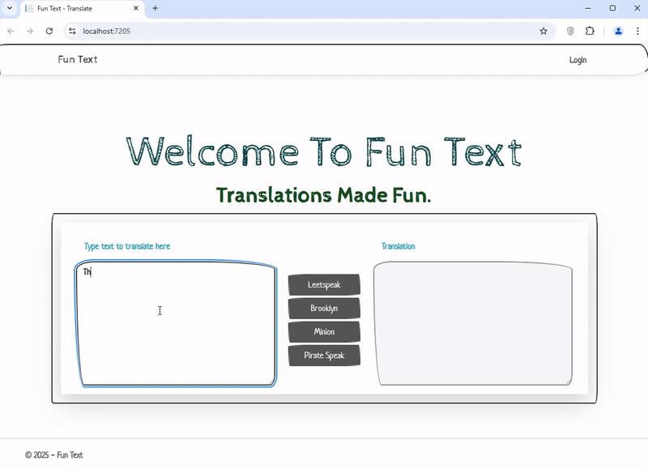
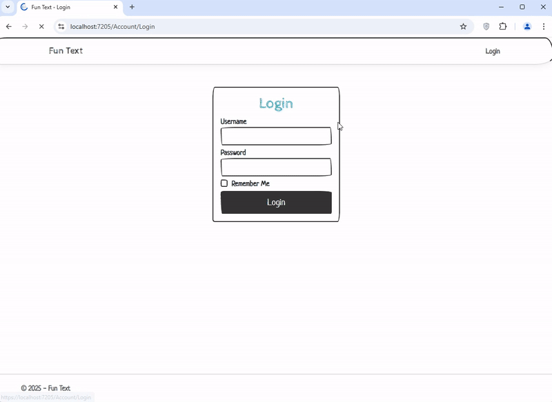
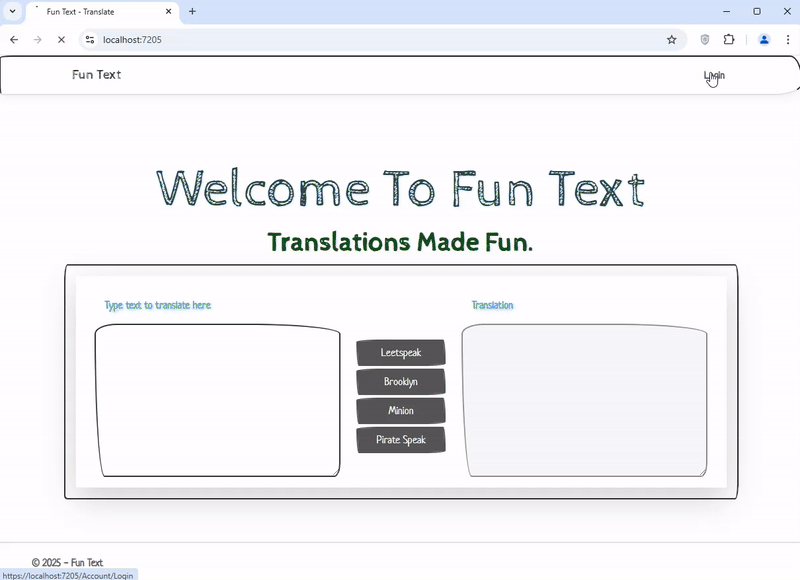

# Fun Text Web App
Fun Text provides a user-friendly interface for getting translations from FunTranslations.com: an online platform that offers a variety of playful translation tools.

## Technologies Used
* C#
* .NET 9
* ASP.NET
* MVC
* Blazor
* SQL Server
* HTML & CSS

## Using The App
### Translating text
1. Enter text to be translated.
2. Click on the desired translator.
3. Wait for translated text.

### Create or edit Translators (For Users with Admin Access)
1. Log in with username and password.
2. Click on "Translators" at the top left section.
3. Click 'New' to add a translator or the Edit icon next to a translator to edit.

### Browse Search History (For Users with Admin Access)
1. Log in with username and password.
2. Click on "History" at the top left section.
3. Click any header to sort by that column.
4. Click on the filter menu to the left of a head to filter by data in that column.

